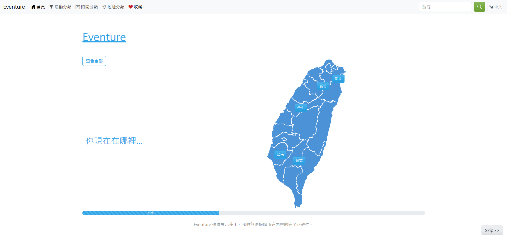
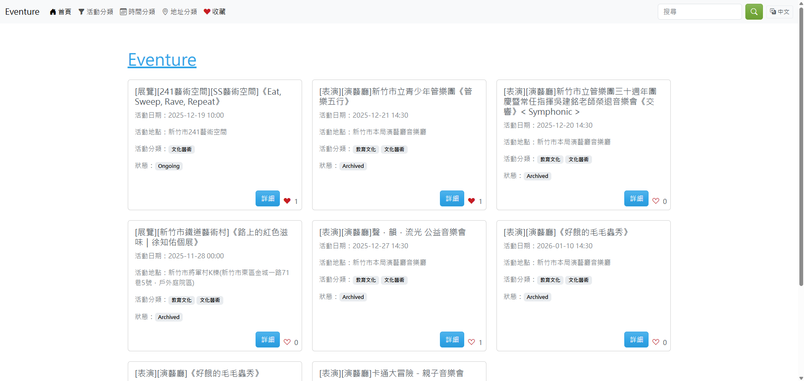
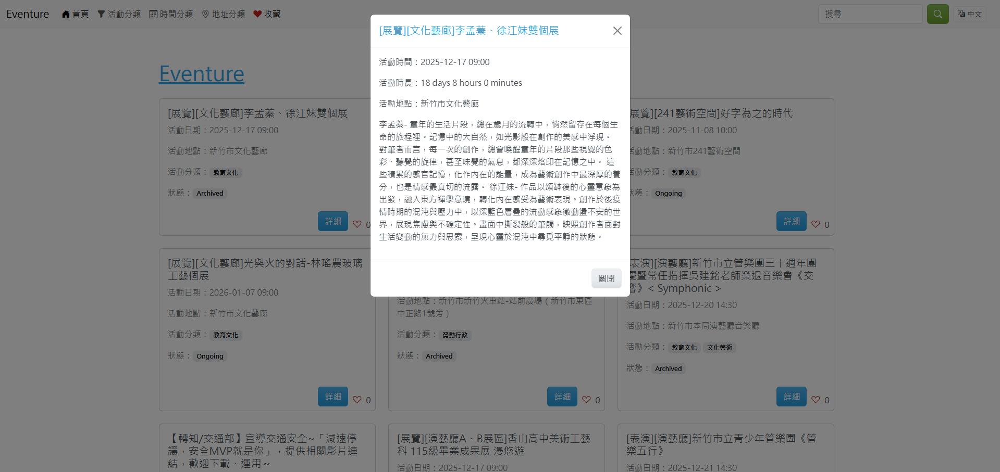
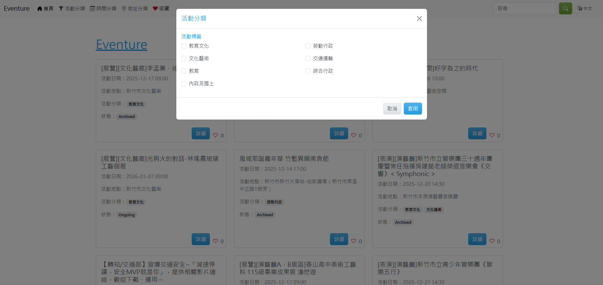
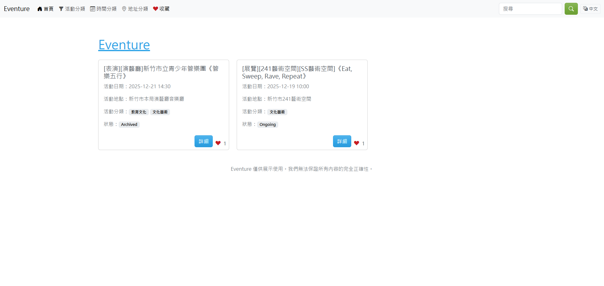

# Eventure

## Motivation

Many people want to go out and have fun but spend too much time swiping through various apps to search for activities in Taiwan. Moreover, when they want to find events in different parts of Taiwan, they have to visit each city's official website separately. Therefore, we aim to create a web application that helps users easily discover activities happening across multiple cities.

## App Features

Our application provides a **one-stop event discovery platform** that helps users easily find activities they are interested in. Instead of visiting multiple sources, users can search for activities through a unified interface. The main features include:

1. Allowing users to apply filters such as **date**, **tag**, and **region** to quickly find relevant activities.

2. Providing a **like** feature that allows users to express interest in activities. The system displays each activity's popularity based on the total number of likes. Users can also view their liked activities on the Liked Activities page.

3. Allowing users to switch the application language using a button.

## Screenshots

### Home Page

  

### Activity Filtering Results

  

### Activity Detail Page

  

### Tag-Based Filtering

  

### Liked Activities Page

  

## App Functionality Overview

1. Visualization

    Sends HTTP requests to retrieve data from the Web API. The information is then wrapped into view objects and used to create the front-end layout.

2. User Input Validation

    Uses the form object `keyboardInput` to validate user input in the search box.

3. Session Management

    + `filters`: The user's filter conditions, including date, tags, and regions.

    + `user_likes`: The IDs of activities that the user has liked.

    + `language`: The user's preferred language (default: 'zh-TW').

4. Real-Time Progress Display

    Displays a progress bar via a Faye WebSocket connection to show real-time progress while the Web API is fetching data from external APIs.

5. Route Management

    * Browser ↔ Web App Routes (User-Facing)
    
      These are the HTTP routes that browsers access directly:
    
      | Route | Method | Description |
      | :--: | :--: | :-- |
      | `/` | GET | Home page; triggers activity fetch with progress display. |
      | `/intro_where` | GET | City selection page for filtering. |
      | `/intro_tag` | GET | Tag selection page based on selected city; accepts `?filter_city=<city>` parameter. |
      | `/activities` | GET | Displays activities matching filter criteria; accepts query parameters like `?filter_city=<city>&filter_tag[]=<tag>&filter_start_date=<date>&filter_end_date=<date>`. |
      | `/activities/search` | GET | Searches activities by keyword; accepts `?keyword=<keyword>` parameter. |
      | `/like` | GET | Displays the user's liked activities. |
      | `/activities/like` | POST | Updates the user's liked activities; accepts `serno` as query parameter or POST body parameter. |
        | `/clear_session` | GET | Clears the user's session and redirects to home. |
      | (any route) | GET | Language switch; accepts `?lang=<language>` parameter (supports 'zh-TW' and 'en-US'). |

    * Web App ↔ Web API Routes (Backend Communication)
    
      These are internal HTTP requests that the Web App (`Eventure-APP`) makes to the Web API (`Eventure-API`) server:
      
      | Route | Method | Purpose |
      | :--: | :--: | :-- |
      | `/api/v1/filter` | POST | Sends filter criteria (city, tags, dates, language) to fetch matching activities. Payload: `{ tag: [], city: '', districts: [], start_date: '', end_date: '', language: 'zh-TW' }` |
      | `/api/v1/activities` | GET | Retrieves the full list of activities without filters. |
      | `/api/v1/activities/search` | GET | Searches activities by keyword; accepts `?keyword=<keyword>&language=<language>` query parameters. |
      | `/api/v1/activities/like` | POST | Updates like count for a specific activity; accepts `serno` as query parameter or POST body parameter. |
      | `/api/v1/cities` | GET | Retrieves list of available cities for filtering. |
      | `/api/v1/districts` | GET | Retrieves list of districts for the selected city. |
      | `/api/v1/tags` | GET | Retrieves list of available tags for filtering. |

## Next Steps

1. Introduce activity data from more cities to enrich the system.

2. Allow users to filter activities not only by city but also by district.

3. Enable filtering by multiple conditions, such as showing art-related activities in Taichung City between 2026/01/01 and 2026/01/31.

4. Remove Archived activities from filter results while keeping the data in the database for future recommendations.

5. Display activities in descending order of like counts to reflect overall popularity.

6. Track users' locations and recommend nearby activities.

7. Recommend activities based on users' previously liked or saved activities.

## User Instructions

Since the application is divided into API and App components, please complete all of the following steps.

### I. Run Eventure-App

1. Clone the [Eventure-App](https://github.com/AMaLina-1/Eventure-APP) project from GitHub.

2. Run `bundle install` to install all required gems.

3. Run `rake new_session_secret` to generate a secret, then fill it into `config/secrets_sample.yml` and rename the file to `config/secrets.yml`.

4. Start the application by running `rake run`.

### II. Run Eventure-API

1. Clone the [Eventure-API](https://github.com/AMaLina-1/Eventure-API) project from GitHub.

2. Run `bundle install` to install all required gems.

3. Register accounts on Redis Cloud and AWS, then create an SQS queue. Fill in the Redis Cloud credentials, AWS credentials, and SQS configuration in `config/secrets_sample.yml`, and rename it to `config/secrets.yml`.

4. Create the database by running `rake db:migrate`.

5. Start the background worker by running `rake worker:run:dev`.

6. Start the API server by running `rake run`.
